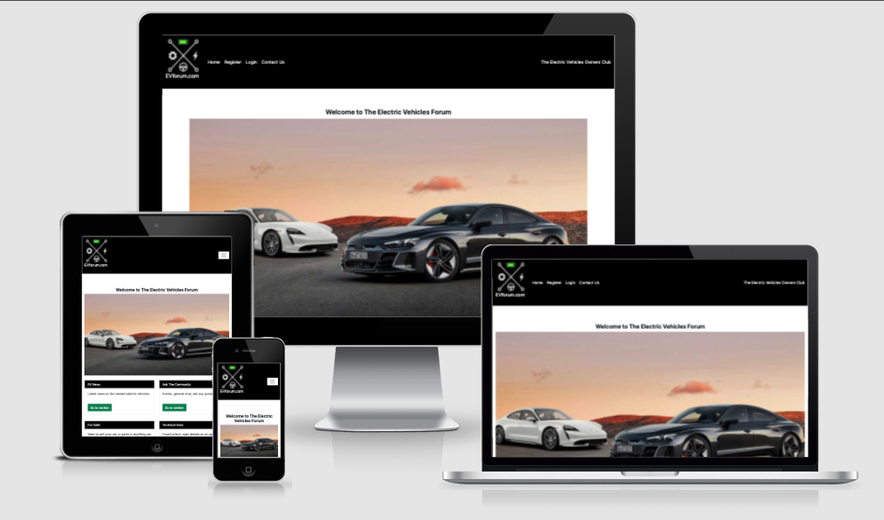
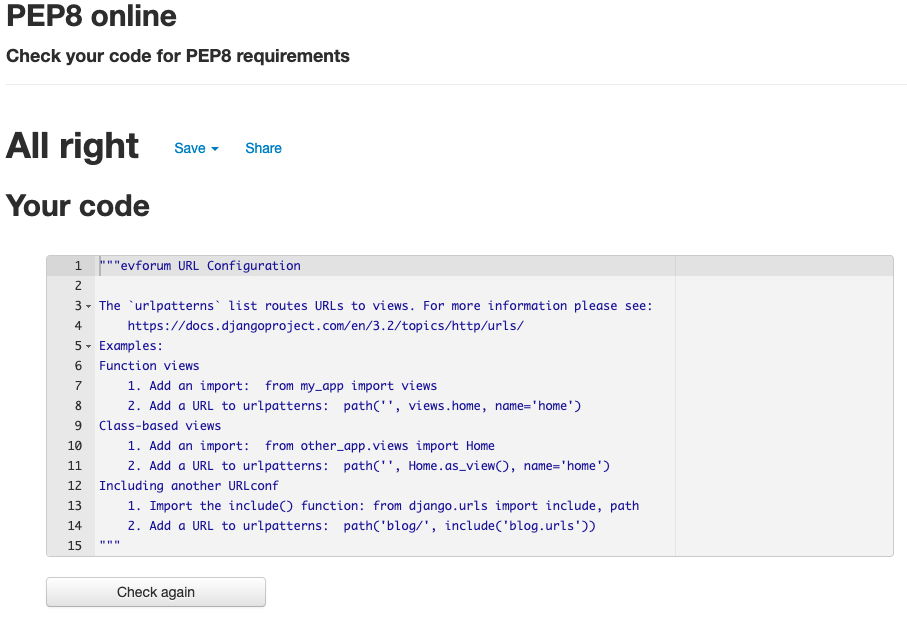
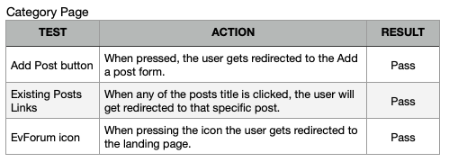

# EVforum.com

Live website [here](https://p4-ev-forum.herokuapp.com/).
 

# Introduction

Welcome to my Project No4. This is based on a Electric Vehicles Owners Club. It allows users to create, comment, like, edit and delete a post. It makes use of the full CRUD functionality.

The website contains four Categories: 
- EV News. Users can create posts about the latest news and topics on electric cars.
- Ask The Community. User can find information about latest car meets, dealerships etc.
- For Sale. Users can sell their cars or accessories.
- Technical Area. Users can ask technical questions regarding evs.

  

## <a name="top">Table of Contents</a>

### [1. User Experience](#user-ex) 

- Design Approach
- User Expectations
	- New Users
	- Returning Users
	- Frequent Users
- Color Design
### [2. Features](#features)
- Landing Page:
	- Picture banner zoom effect
	- Navigation Bar
	- Category Cards:
		- EV News
		- Ask The Community
		- For Sale
		- Technical Area
	- Recent Post View
- Category Section:
	- Adding a Post button
	- View all Posts from that category
- Footer
- CRUD Functionality
- Authentication
- Input Validation
- Custom 404 Not Found Page

### [3. Wireframe](#wireframe)
### [4. Testing](#manual-testing)
- PEP8 Validator
- Manual Testing
### [5. Technologies Used](#tech-used)
### [6. Deployment](#deployment)
### [7. Bugs](#bugs)
- Known Fixed Bugs
- Existing Bugs
### [8. Credits](#credits)

  

[Top of the page](#top)
# <a name="user-ex">1. User Experience</a>

## Design Approach 

The website is design with a simplistic approach in mind. Some of the features were inspired by the "I think therefore I blog" Code Institue module. 

I have made full use of Bootstrap's and Django's "batteries included" features, where it has helped me to quickly design the website and focus on the backend development.

The idea was to keep the website simple and straight forward for users to use.
  

## User Expectation

The main goal of the website is to allow users to interract with eachother by signing up, logging in and creating posts. They can also edit a post, comment on it and delete it if need be. All in a very simple manner. This allows them to find information on the latest news for electric cars and maintenance tips.

 

- ### A new user:
	- A new use will understand the purpose of the website. 
	- They will want create an account.
	- They will start to create and modify the content.
	- They will want to delete a post created by them.
	- They will leave a comment on any post.

 

- ### A returning user:
	- Will edit any existing owned posts.
	- Leave a comment on any posts.
	- Delete any owned existing posts.

 

- ### A frequent user:
	- Will check for any new content or features added to the site.

 

[Top of the page](#top)

## Color Design

The colour scheame was picked in the intention of keeping simple and consistent. This has also allowed to website to be more accessible for those visually impaired. 

The Message Alerts have been chosen green to emphasize that a comment or a post has been added successfully.  
 

  

[Top of the page](#top)

# <a name="features">2. Features</a>
## Landing Page

### Main Image Banner

The Main image on the landing page zooms in when first loaded.

### Navigation Bar
Small to Medium Screens

Large Screen

### Category Cards

The 'Go to section' button will take the user to their chosen section.

### Recent Posts

The 'Recent Posts' section on the landing page shows the last 6 recent posts made by all users. On the right hand side there's a 'Created' section shows the date and time when the post was created.

[Top of the page](#top)

## Footer

All the social media icons one in a new tab when clicked on. They also have a green hover effect.

 

[Top of the page](#top)

## CRUD Functionality

A user can:

Create a post.

  

Details entered, post created.

  

Edit a post. The existing information gets loaded and allows the user to change the text.

  

Alert once the post has been amended successfully.

  

Delete a post Modal as long as the user is the author of the post.

  

Alert once the post has been deleted succesfully.

  

Comment on a post. 

  

Comment alert.

  

Comment added on the feed. 

[Top of the page](#top)
## Authentication

A user can Sign Up, Login and Logout from the website. This has been achieved using Django's batteries included features and a library called [allauth](https://django-allauth.readthedocs.io/en/latest/installation.html).

Sign Up form.

  

Login form.

Once registered or signed up, the user will be redirected to the homepage.
  

## 404 Not Found

[Top of the page](#top)
## <a name="wireframe">3. Wireframe</a>
The wireframe was created using Balsamiq.

### Database Wireframe

  

[Top of the page](#top)
## <a name="testing">4. Testing</a>

### PEP8 Validator

admin.py

apps.py

forms.py

models.py

urls.py

views.py

setting.py 
I have decided to ignore these warnings as trying to split the code would result in potential errors. The code is easy to read and understand in its current format.

urls.py evforum configuration

### CSS Validator

style.css 

### HTML Validator

  

[Top of the page](#top)
### Manual Testing
I have been using AmIResponsive to check the responsivness of the website.

I have used Lighthouse for performance and accessibility check.

  

[Top of the page](#top)
## <a name="tech-used">5. Technologies used</a>

### HTML5
### CSS3
### Python
### Javascript
### Boostrap 5
### Django 3.8
### PostgreSQL
### Heroku
### Gitpod
### Github
### Balsamiq
### FontAwesome
### Google Fonts
### Google Chrome

  

[Top of the page](#top)

## <a name="deployment">6. Deployment</a>

### First Deployment

### Gitpod:
- Create a new repository using the Code Institute template
- Follow the guide provided by CI to install Django and it's dependencies
- Create the new project 'evforum.com'
- Link to Heroku via the Procfile
- Create requirements file

### Heroku
- Log in to Heroku and create a new app 'p4-ev-forum'
- in the 'Resources' tab search for PostgreSQL and sellect the 'hobby' option.
- In the 'Settings' tab enable Config Vars
- Link the following:
	- CLOUDINARY_URL
	- DATABASE_URL
	- SECRET_KEY
	- DISABLE_COLLECTSTATIC set to 1

### Github
- Create env.py file and link the database from Heroku
- Add:
	- CLOUDINARY_URL
	- DATABASE_URL
	- SECRET_KEY
- Commit and push to Github

### Heroku
- Under 'Deploy' tab connect the Github repo by searching it in the search bar.
- Select 'Manual Deployment' and make sure the logs throw no errors.
- Once compelted, select View.
- This is the result

### Production Deployment

### Github & Gitpod 
- Set DEBUG=False in the settings.py file
- Update the requirements.txt file
- Push to Github

### Heroku
- In the 'settings' tab reveal the config vars
- Remove DISABLE_COLLECTSTATIC
- Under the 'deploy' tab, select 'Deploy Manually'
- Once finished, select View
- This is the Result

  

[Top of the page](#top)

## <a name="bugs">7. Bugs</a>

### Known Fixed Bugs

Throughout the development process a few bugs have been encountered, however one was paticularly challenging to solve:

Problem: 
Initially I could not perfom the initial deployment successfully. This is because I have tried to use Django 4.0 and some additional steps were needed to ensure the deployment was successfull 

Solution: 
I have downgraded to Django 3.8 for the purpose of this project.

Problem: 
When trying editing an existing post, the Image field was displaying a link to cloudinary to whichever picture was previously uploaded. Occassionally this would have thrown a not found error but not all the time.

Solution: 
I have chosen to remove the Image field if a post was edited so the image link is not displayed. Another solution would have been to use Javascript to try and disable the link, giving the user the option to change the picture.

Problem: 
When adding a new post, the page was getting redirected to the home page. I wanted to redirect it to the post it'self however the redirection to the post.id was set wrongly causing an error to appear.

Solution: 
The solution was to setup the redirection correctly. 

  
### Existing Bugs

W3 HTML validator shows some errors which are not present in my code. This only shows when the jinja content is loaded. All of the html tags are opened and closed correctly.

  

[Top of the page](#top)

## <a name="credits">8. Credits</a>

- [Stack Overflow](https://stackoverflow.com/) for help with code troubleshooting and suggestions on best practices.

- Code Institute for the Gitpod initial template.

- My mentor Marcel Mulders for the constructive feedback and always pushing to go the extra step.